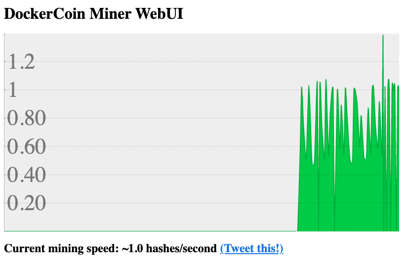
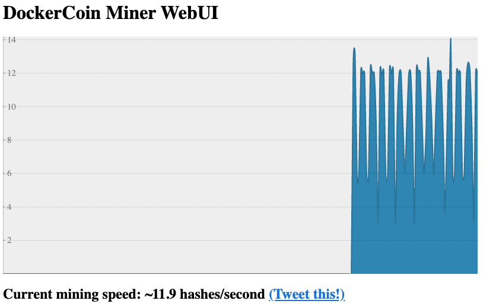

## Deploy the dev stack from scratch

- `task all`{{execute}} will deploy dev environment after a cleanup

## Check the deployment

`watch "kubectl get pods -n dockercoins"`{{execute}}

Hit `Ctrl-C`when all the pods are in ready state

## Acecss to the webui

Copy/Paste the output in a browser the output of this command

`echo ' '; echo [[HOST_SUBDOMAIN]]-$(kubectl get -o jsonpath="{.spec.ports[0].nodePort}" services webui -n dockercoins)-[[KATACODA_HOST]].environments.katacoda.com`{{execute}}

It could take time before mining start because it'is a very small kubernetes cluster (minikube)

After a while you should see something like this

## Test other environments

To see the difference between current running version an QA

`tk diff $HOME/dockercoins/environments/qa`

in green you will see the differences :

- eg: dockercoins/rng:v0.2

**To deploy the QA env**

- `ENV=qa task deploy`{{execute}} will deploy QA environment

or if you prefer use `tk`command

- `tk apply $HOME/dockercoins/environments/qa`{{execute}}

**To deploy the PROD env**

- `ENV=prod task deploy`{{execute}} will deploy PROD environment

or

- `tk apply $HOME/dockercoins/environments/prod`{{execute}}

After a while you should see something like this after refreshing browser window

Notice the number of hashes et the fonts of ui

## Cleanup

- `task clean`{{execute}}

### Templates

- default : main.jsonnet - Just use config and project file
- dev = default
- qa : change namespace and some tags of images,
- prod : change namespace, some tags of images and replicas (patching)
